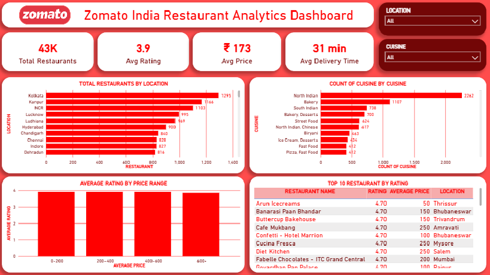

# 🍽️ Zomato India Restaurant Analytics Dashboard

An end-to-end Data Analytics project built using **Python, SQL, and Power BI** to analyze restaurant data from Zomato India and uncover meaningful business insights related to pricing, ratings, cuisine popularity, and delivery performance.

---

## 📌 Project Overview

This project analyzes **43K+ restaurant records across India** from Zomato's dataset to understand customer preferences and restaurant performance.

The complete analytics workflow includes:

- Data Cleaning using Python
- Data Analysis using SQL
- Dashboard Development using Power BI
- Business Insight Generation

---

## 📊 Dashboard Preview

---

## 🎯 Business Objectives

This project aims to answer the following business questions:

- Which locations have the highest number of restaurants?
- Which cuisines are most popular?
- Does higher pricing result in better ratings?
- Which restaurants are top-rated?
- What is the average delivery time?

---

## 📈 Key Insights

- Total Restaurants Analyzed: **43K+**
- Average Rating: **3.9 / 5**
- Average Price: **₹173**
- Average Delivery Time: **31 minutes**
- Kolkata has one of the highest restaurant concentrations
- North Indian cuisine is the most popular cuisine
- Higher pricing does not strongly correlate with better ratings

---

## 🛠 Tech Stack

- Python (Pandas, NumPy)
- SQL
- Power BI
- Jupyter Notebook

---

## 📂 Project Files

### Dataset
- `zomato_messy_data.csv` → Raw dataset
- `clean_zomato.csv` → Cleaned dataset

### Python
- `zomato_data_cleaning.ipynb` → Data cleaning and preprocessing notebook

### SQL
- `zomato_insights.sql` → SQL queries for business analysis

### Power BI
- `zomato_dashboard.pbix` → Interactive dashboard file
- `zomato_dashboard.png` → Dashboard preview image

### Assets
- `zomato_logo.png` → Dashboard branding asset

---

## 🔄 Workflow

### 1. Data Cleaning (Python)
Performed:
- Missing value handling
- Duplicate removal
- Column cleaning
- Data type correction

### 2. SQL Analysis
Performed analysis such as:
- Top-rated restaurants
- Cuisine popularity
- Location-wise restaurant count
- Rating and price comparison

### 3. Dashboard Development (Power BI)
Created interactive dashboard with:

✅ KPI Cards  
✅ Location Analysis  
✅ Cuisine Analysis  
✅ Price vs Rating Analysis  
✅ Top Rated Restaurants  

---

## 🚀 Skills Demonstrated

- Data Cleaning
- Exploratory Data Analysis
- SQL Querying
- Data Visualization
- Dashboard Design
- Business Storytelling

---

## 👨‍💻 Author

**ABUZAR SHAIKH**  
Aspiring Data Analyst | Python | SQL | Power BI

---

⭐ If you found this project interesting, consider giving this repository a star.
